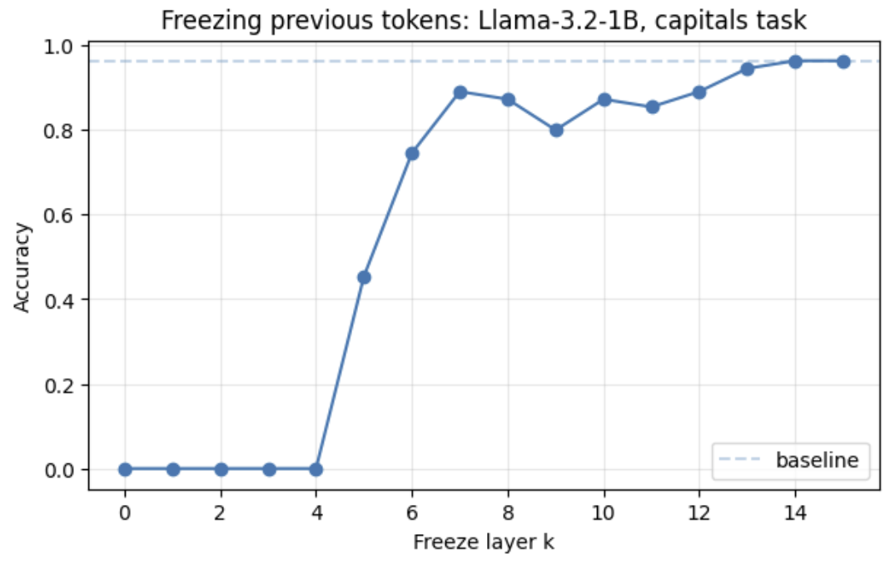
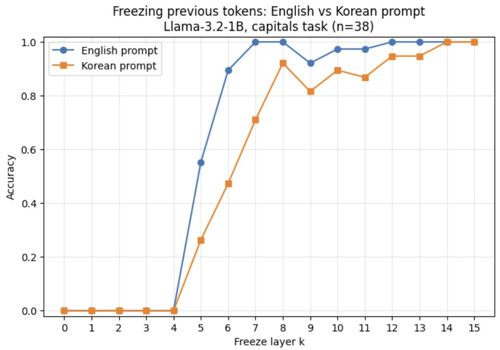

[Attend First, Consolidate Later: On the Importance of Attention in Different LLM Layers](https://arxiv.org/abs/2409.03621)

[Code: add english vs korean freeze comparison and clean dataset](https://github.com/siwonnn/attend-first-consolidate-later/commit/0712013ca1bad67ec06e3f21d0485ff0d34e38b2)

Continuing on the last post, I tried to check if the model behaves differently when the prompt is given in Korean. To isolate the effect of processing Korean from the effect of producing Korean tokens, I held the answer (the capital city for each country) fixed as a single English token and varied only the prompt language.

I changed the prompt from `Q. What is the capital of France? A. Paris Q. What is the capital of {country}? A.` to `질문. 프랑스의 수도는? 답. Paris 질문. {country}의 수도는? 답.` and ran the baseline model without any manipulation. The accuracy for Korean prompt was worse than the English prompt. While inspecting the data the model got wrong, I found a problem in the dataset.

## Problem 1. Dataset Quality
```
country: Algeria | predicted: Alg | correct: Alger
country: Austria | predicted: Vienna | correct: Wien
country: Czech Republic | predicted: Prague | correct: Praha
country: Hong Kong | predicted: Hong | correct: Victoria
country: Italy | predicted: Rome | correct: Roma
accuracy: 0.877
```

Above is the data that the English baseline model got incorrect. It shows that most of the incorrect predictions occur because of an endonym, exonym mismatch. The dataset has the endonym as a correct label, but the model is predicting the English exonym for the city name. We also see the model got Hong Kong wrong, but Hong Kong is not considered a country.

To tackle this problem, I relabeled the city names to English exonyms, removing any item whose new label isn't a single token. Then I removed data that are not sovereign countries, such as Hong Kong, Montserrat, and Bermuda. I also excluded France from the dataset because it appears in the one-shot example, so the model can copy its answer without retrieval. We previously had 57 data points in the dataset, and after this process, we are left with 44 data points.

Then I reran the baseline model for both English and Korean after adding the Korean name for each country. Here I found another problem in my code.

## Problem 2. Not using greedy decoding in baseline prediction
The baseline accuracy was different for Korean if I ran it multiple times. This is a problem because we can't reproduce the result, and it confounds the comparison since it makes Korean inherently noisier than English regardless of freezing.

I resolved this problem by using `argmax` to predict the next token instead of using `model.generate()` because it uses sampling generation by default.

Before:
```
outputs = model.generate(inputs.input_ids, max_new_tokens=1, attention_mask=inputs.attention_mask, pad_token_id=model.config.eos_token_id)
return tokenizer.decode(outputs[0][inputs.input_ids.shape[1]:]).strip()
```

Fix:
```
outputs = model(**inputs)
last_token_logits = outputs.logits[:, -1, :]
predicted_token_id = torch.argmax(last_token_logits, dim=-1)
predict = tokenizer.decode(predicted_token_id.squeeze())
return predict.strip()
```

## Baseline accuracy
After patching these two problems, the accuracy for English baseline reached 1.0 on the cleaner dataset up from 0.877 on the original, mostly because the corrected labels no longer penalize correct exonym predictions. We have 0.867 accuracy for Korean baseline, and now we have a consistent result for multiple executions. Below are the data that the Korean baseline got incorrect.

```
country: 호주 | predicted: Melbourne | correct: Canberra
country: 이스라엘 | predicted: Tel | correct: Jerusalem
country: 몰디브 | predicted: Mal | correct: Male
country: 세이셸 | predicted: Nou | correct: Victoria
country: 스위스 | predicted: Zurich | correct: Bern
country: 시리아 | predicted: Dam | correct: Damascus
accuracy: 0.867
```

We can see that the incorrect predictions are not due to the endonym/exonym mismatch anymore, but the model is genuinely wrong.

## Freezing and Results
Now we apply a freezing manipulation to the model, and run for both English and Korean. This time, we only use 38 data that both languages' baseline got correct since we're interested in the point where performance breaks as we freeze earlier and earlier, and we require correctness in both languages so that any difference between the curves reflects freezing, not a baseline knowledge gap.

I plotted the accuracy by freeze layer k for each language, as well as the plot I drew at the last post which I regenerated after fixing the two problems above.





I swept the freeze layer k from 0 to 15 for both English and Korean prompts, over the 38 capitals the model answered correctly in both languages at baseline, measuring single token exact-match accuracy. Both curves are flat at zero for k<=4, and begin rising at k=5, showing plateau near 1.0 at high k. The curve shows that Korean lags English throughout the climb. At each k in the transition, Korean accuracy is lower. English crosses 0.5 accuracy at k=5, and Korean between k=6 and k=7.

We can interpret that the two-phase structure is present in both languages and starts at the same depth, but the transition is shifted about 1 layer later in Korean, suggesting that Korean context requires slightly more processing depth before previous-token representations stabilize, possibly because Korean fragments into more tokens in this tokenizer.

## Limitations and further work
This experiment has clear limitations. The dataset is small (n=38), so each item is about 2.6% of the entire dataset, and the curves carry item-level noise. Single-token exact-match also constrains the dataset to capitals that are one token in English, and is a coarse metric. A natural next step is to escape both constraints with likelihood-based scoring, which measures the probability the model assigns to the correct answer rather than just its top token. This would allow multi-token capitals and a much larger dataset, reduce the item-level noise, and enable the fully Korean setting (Korean prompt and Korean answer), which the single-token method cannot handle since most Korean capitals span several tokens.
